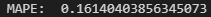
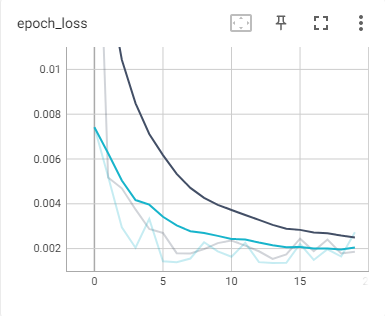

# COVID-19_Cases_Prediction
 
#### 1. Data Loading
        -Load dataset by using pd.read_csv()

#### 2. Data Inspection/Visualization
        -Inspect the the data info for the type of data, duplicates and missing data.

#### 3. Data Cleaning
        -Clean the data by changing data type and fill the missing value using interpolation.
        -Check the data by plotting the graph.

#### 4. Data Preprocessing
        -Reshape the 'cases_new' from train data into 2D shape.
        -Normalize the feature using MinMaxScaler where the data range is normalized into 0 to 1.
        -Split the data into train and validation data
        
#### 5. Model development
        -The model based on 3 layers of LSTM with 64 nodes each build as hidden layer.
        -The model is trained for 20 epochs.
        -The training process is monitored through TensorBoard.

  

#### 6. Model Evaluation
        -The evaluation of this model is used with the MAPE metrics in which the model scored achieved is between 0.16%-0.20% between test run.

  

  
       
#### 7. Model Saving
        -The scaler and model is save into their own file to be loaded for deployment.
        
## Acknowledgements

 - [The Dataset for Covid-19 cases is obtained from MOH](https://github.com/MoH-Malaysia/covid19-public)
